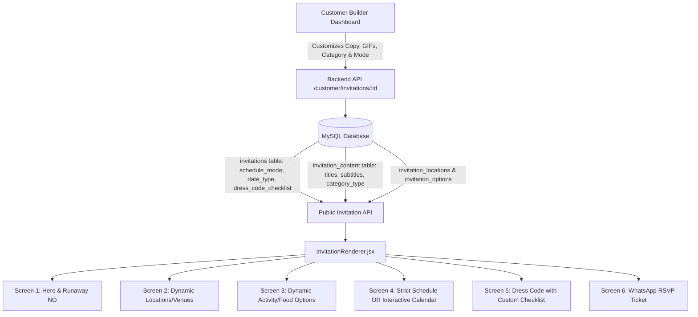

# Comprehensive Analysis: Dynamic Invitation Builder, GIF Library & Interactive Scheduling

## 1. Executive Summary & Problem Diagnosis

Based on the 4 provided screenshots and code inspection of the invitation renderer and customer dashboard, the current system suffers from **hardcoded strings, rigid categories, missing builder controls, and UI rendering bugs**.

---

### Screenshot-by-Screenshot Diagnosis

| Screen | Visual Evidence in Screenshot | Root Cause in Code |
|---|---|---|
| **Screenshot 1: Step 1 (Where are we heading?)** | • All 3 cards display the exact same tuxedo cat GIF. • Description text is duplicated twice (e.g., *"Boujee, elegant, and dress-to-impress energy."* rendered in pink and repeated in gray below). • Section title is static. | 1. **Casing Mismatch:** Database returns `image_url` (snake_case), but `ScreenLocation.jsx` checks `l.imageUrl` (camelCase). It falls back to `/gifs/loc_skymate.gif` for all 3 cards. 2. **Duplicate Rendering:** `loc.subtitle` falls back to `loc.description`, and JSX renders both `
{loc.subtitle}
` and `
{loc.description}
`. 3. `InvitationRenderer.jsx` passes `sectionTitle={content.sectionTitles?.locations}` while `ScreenLocation` expects `title`. |
| **Screenshot 2: Step 2 (And what are we eating?)** | • All 3 cards display the exact same white popcat GIF. • Tagline and description duplicated. • **Rigid category:** Locked to food/cuisine with no option for activities, nightlife, drinks, or custom experiences. | 1. **Casing Mismatch:** `f.imageUrl` is undefined because SQL returns `f.image_url`. Falls back to `/gifs/food_lebanese.gif` for all cards. 2. **Duplicate Rendering:** `food.quote` and `food.description` both evaluate to `f.description`. 3. Hardcoded table `food_options` with no ability in the builder to change the section title or create non-food options. |
| **Screenshot 3: Step 3 (When? / Schedule)** | • Locked to "Tomorrow at 6:00 PM". • Hardcoded button reads: *"Option Disabled by Dana 💅"* (even if the partner's name is Sarah, Juliet, or Maria). • No interactive calendar/date picker exists. | 1. `ScreenWhen.jsx` hardcodes `recipientName = 'Dana'`. 2. Builder dashboard only allows typing a text string for date & time; it has **no toggle for Schedule Mode (Strict vs. Interactive Date Picker)**. |
| **Screenshot 4: Step 4 (What should you wear?)** | • Checklist bullets (*"Clean kicks & cozy vibes"*, *"Fragrance on point"*, *"Your best smile"*) are hardcoded array defaults. • Subtitle is static. • Customer cannot customize checklist or choose a different GIF. | 1. `ScreenDressCode.jsx` uses `DEFAULT_CHECKLIST` array constant. 2. Builder dashboard only exposes a single `dress_code` input and does not allow editing checklist bullets or choosing GIFs. |

---

## 2. Detailed Understanding of User Requirements

### A. 100% Dynamic Content Across All Screens
No user-facing text should be hardcoded. The customer must have complete creative control in the builder:
- **Step 1 (Outings / Venues):**
  - Section badge (e.g., *"✨ Decision Time"*).
  - Title (e.g., *"Okay… since you said YES 😌❤️"*).
  - Subtitle (e.g., *"Now we have some important decisions to make. Where are we heading?"*).
  - Card 1, 2, 3: Custom Name, Category Tag, Tagline, Description, and Selected GIF.
- **Step 2 (Custom Category Beyond Food):**
  - Ability to choose category type: **Food & Cuisine**, **Activities & Adventures** (e.g., Cinema, Bowling, Stargazing, Painting, Escape Room), **Drinks & Nightlife**, or **Custom Event**.
  - Section badge (e.g., *"🍴 The Feast"*, *"🎯 The Adventure"*, *"🍸 Cocktails & Vibes"*).
  - Title & Subtitle.
  - Card 1, 2, 3: Custom Name, Tag, Description, and Selected GIF.
- **Step 3 (Schedule & Date):**
  - Section badge, Title, and Subtitle.
  - **Choice between Two Scheduling Modes (see below).**
- **Step 4 (Dress Code & Vibe Check):**
  - Section badge, Title, and Subtitle.
  - Dress code heading (e.g., *"CASUAL"*, *"FANCY"*, *"COZY HOODIE"*).
  - Dress code quote/instructions.
  - **Dynamic Checklist:** Editable checklist bullet points (add, edit, remove items).
  - Selected GIF.

---

### B. GIF Library Picker in the Builder Dashboard
- Customers should not have to manually paste image URLs.
- A visual **GIF Library Selector Modal** must be integrated into the builder.
- Powered by `GET /api/v1/customer/gifs` with categorized tabs:
  - **Romantic & Pleading** (Hero proposal, cute pleading cats, heart reactions)
  - **Funny & Teasing** (Runaway cats, sunglasses cat, strike 3 angry cats)
  - **Venues & Outings** (Fancy wine cat, rooftop city cat, beach lounger cat)
  - **Food & Treats** (Feast cat, pasta cat, hamster sandwich)
  - **Activities & Nightlife** (Bowling, popcorn movie cat, dancing)
  - **Schedule & Clocks** (Cat changing clock, waiting cat)
  - **Dress Code** (Casual hoodie cat, tuxedo cat, stylish cat)
  - **Celebration** (Confetti party cat, victory dance)
- 1-click preview and assignment to any card or screen slot.

---

### C. Schedule Mode Choice: "Strict Schedule" vs. "Interactive Date Picker"
In the builder dashboard, the customer chooses how their date is scheduled:

#### Mode 1: "Strict Schedule (Playful / Humorous)"
- Pre-set date and time (e.g., *"This Friday at 8:00 PM"*).
- Playful badge: *"🔒 FIRMLY LOCKED IN"*.
- Humorous disabled button dynamically says: *"Option Disabled by [Partner's Real Name] 💅"*.
- Humorous quotes and callouts customizable by customer.

#### Mode 2: "Interactive Date Picker (Flexible Scheduling)"
- The recipient can actually choose a date!
- Interactive calendar grid allowing the recipient to pick an available date (or choose from 2–3 suggested dates proposed by the customer).
- Time slot picker (e.g., Evening 7:00 PM, Afternoon 2:00 PM, Sunset 6:30 PM).
- RSVP WhatsApp ticket reflects the date and time selected by the recipient!

---

### D. Bug Fixes for Visual Quality
1. **Fix Image URL Casing:** Ensure `image_url` vs `imageUrl` normalization across backend queries and frontend props so cards never default to the same image.
2. **Remove Text Duplication:** Split `subtitle`/`tagline` from `description` in card components so the exact same sentence is never rendered twice.
3. **Prop Forwarding in `InvitationRenderer`:** Forward `title`, `subtitle`, `recipientName`, `scheduleMode`, and `checklist` cleanly to all child components.

---

## 3. Architecture & Data Model Plan

---

## 4. Implementation Steps

1. **Database Schema Enhancements:**
   - Update `invitations` table: add `schedule_mode ENUM('strict', 'picker') DEFAULT 'strict'`.
   - Update `invitation_content` table: add `location_subtitle`, `food_subtitle`, `when_subtitle`, `dress_code_subtitle`, `category_type VARCHAR(100) DEFAULT 'food'`, and `dress_code_checklist JSON`.
   - Update `invitation_food_options` table: add `custom_name`, `custom_description`, `custom_image_url`, `custom_tag`.
2. **Backend API & Service Upgrades:**
   - Extend `customer.service.js` and `customer.repository.js` to support updating custom options, locations, schedule mode, and checklists.
   - Normalize GIF and image URLs to both camelCase and snake_case in API responses.
3. **Frontend Screen Polish:**
   - Refactor `ScreenLocation.jsx` and `ScreenFood.jsx` to eliminate duplicate text rendering and support custom categories.
   - Refactor `ScreenWhen.jsx` to support dual-mode (Strict locked-in vs. interactive date picker).
   - Refactor `ScreenDressCode.jsx` to render dynamic checklist items.
   - Standardize `InvitationRenderer.jsx` prop mapping.
4. **Builder Dashboard UI Overhaul:**
   - Add tabs/accordions for:
     1. **Proposal & Teasing** (Opening, Question, Buttons, Angry modal)
     2. **Outings / Venues** (Titles, 3 Cards with GIF picker)
     3. **Activity / Food Options** (Category selector: Food vs Activity vs Drinks, Titles, 3 Cards with GIF picker)
     4. **Schedule & Date Picker** (Toggle Strict vs Interactive Calendar, Times, Callout copy)
     5. **Dress Code & Checklist** (Dress code note, Quote, Add/Edit/Delete checklist bullets, GIF)
   - Add **GIF Library Modal** with categorized Tenor cats.
5. **Testing & Verification:**
   - Verify with `npm run build` and E2E lifecycle test suite.
