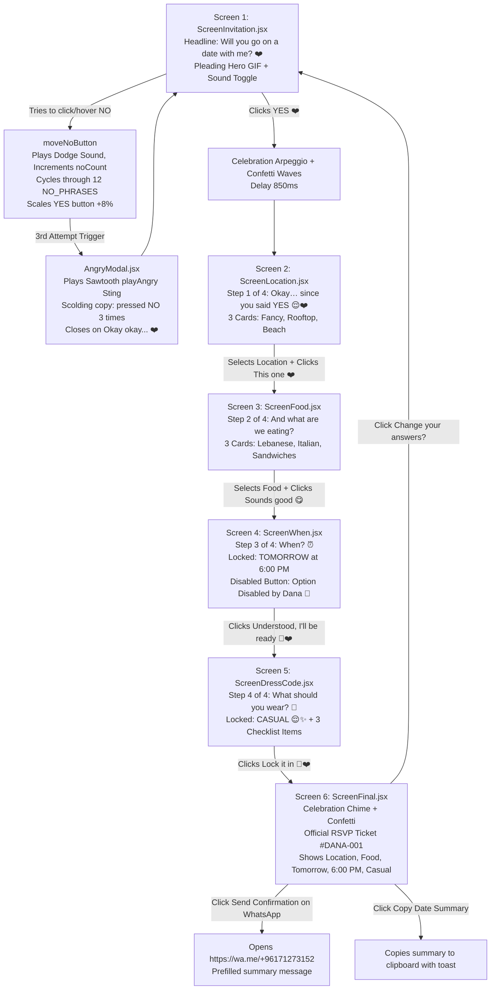
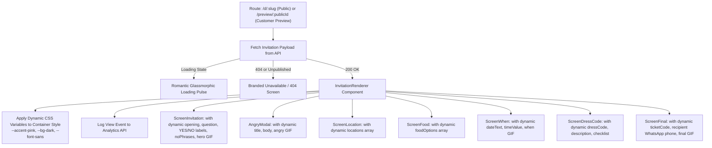
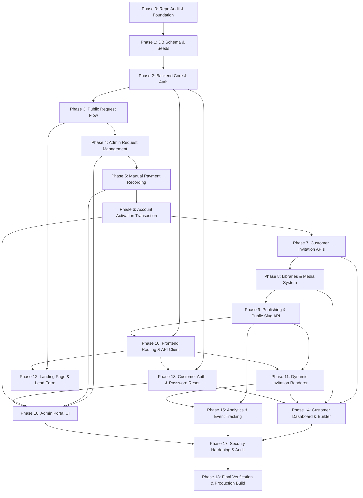

# Platform Technical Assessment & V1 Implementation Plan

> **Project:** Digital Invitation Platform  
> **Source Base:** Dana's Date Invitation (React 19 + Vite)  
> **Target Backend:** Node.js + Express.js  
> **Target Database:** MySQL 8+ via `mysql2/promise`  
> **Authentication:** JWT Access Token + Refresh Sessions (Argon2id/Bcrypt)  
> **Payment Model:** Manual Verification & Admin Activation (No online payment gateway in V1)  
> **Date:** September 8, 2026  

---

## 1. Executive Technical Assessment

### Existing Application Summary
The repository at `c:/Projects/dana` is an interactive single-page web application originally tailored as a date proposal for **Dana**. It is built with **React 19.2.8** and **Vite 8.2.2**. 

It currently possesses:
* **No Backend**: All interactions run purely on the client.
* **No Database**: All choices, options, and recipient data are hardcoded.
* **No Authentication**: The site displays the same invitation to any visitor.
* **No Routing**: All screen navigation is controlled via local React state (`screen` 1 through 6).

### Key Strengths of the Existing Frontend
* **Luxury Glassmorphic Aesthetic**: Deep velvet burgundy palette (`#0f0207` to `#3a0820`), glass panels (`rgba(35, 8, 22, 0.72)`), and glowing rose accents (`#ff4d6d`) defined in `src/index.css` and `src/App.css`.
* **Zero-Dependency Procedural Audio**: Browser Web Audio API frequency synthesis in `src/utils/sound.js` (sine, triangle, and sawtooth tone generators with celebration arpeggios).
* **Floating Particle Canvas**: Custom HTML5 canvas heart and star particles in `src/components/BackgroundParticles.jsx`.
* **Playful Micro-Interactions**: Evasive "NO" button with 12 cycling taunts, mathematical collision-rejection physics avoiding the "YES" button, progressive scale expansion on the "YES" button, a dramatic "Strike 3" angry scolding modal (`AngryModal.jsx`), multi-stage confetti bursts, and an official RSVP ticket pass with WhatsApp deep-link dispatch.

### Target Architecture
We are transforming this single-purpose static app into a database-driven, multi-tenant digital invitation platform:

```text
Visitor / Customer / Admin
           │
           ▼
 React + Vite Client (Single SPA)
   ├── Public Landing Page (Request Form)
   ├── Customer Dashboard & Invitation Builder
   ├── Admin Dashboard (Requests, Payments, Activation, Libraries)
   └── Dynamic Invitation Renderer (/d/:slug & /preview/:publicId)
           │
           ▼ (JSON over HTTP /api/v1/*)
 Node.js / Express.js REST API
   ├── Authentication & Refresh Session Guard
   ├── Role & Ownership Enforcement Middleware
   ├── Zod Schema Validation & Multer Uploads
   └── Business Services & Atomic Transactions
           │
           ▼ (mysql2/promise Pool)
 MySQL 8+ Database (22 Tables)
```

### Core Architecture Principle: The Invitation Renderer
The existing 6-screen invitation flow must **NOT** be recreated or redesigned. Instead, it becomes a **pure dynamic renderer**. When a visitor visits `/d/:slug` (e.g., `/d/dana-7f82k` or `/d/sarah-19kd2`), the backend supplies a single JSON configuration object:

```json
{
  "invitation": {
    "slug": "dana-7f82k",
    "recipientName": "Dana",
    "status": "published",
    "date": {
      "type": "tomorrow",
      "text": "Tomorrow",
      "time": "18:00",
      "timezone": "Asia/Beirut"
    },
    "dressCode": {
      "value": "Casual",
      "description": "Nothing too serious. Just look cute."
    }
  },
  "content": {
    "openingText": "I have a very important question for you…",
    "questionText": "Will you go on a date with me? ❤️",
    "yesButtonText": "YES ❤️",
    "noButtonText": "NO",
    "noPhrases": [
      "Nice try 😏",
      "Too slow!",
      "Error 404: No not found 💅"
    ],
    "angry": {
      "title": "EXCUSE ME?! 😤",
      "message": "You have pressed NO THREE TIMES. I am starting to take this personally. 😭💔",
      "button": "Okay okay… ❤️"
    },
    "sectionTitles": {
      "locations": "Okay… since you said YES 😌❤️ Where are we heading?",
      "food": "And what are we eating?",
      "when": "When? ⏰",
      "dressCode": "What should we wear? 👕"
    },
    "final": {
      "title": "IT'S A DATE. ❤️",
      "message": "Congratulations. You have successfully agreed to go on a date with me. 😂❤️"
    }
  },
  "theme": {
    "name": "Romantic Velvet",
    "primaryColor": "#ff4d6d",
    "secondaryColor": "#ff758f",
    "backgroundColor": "#0f0207",
    "textColor": "#ffffff",
    "fontFamily": "Outfit"
  },
  "locations": [
    {
      "name": "Fancy",
      "subtitle": "Fine dining & candlelight ✨",
      "description": "Boujee, elegant, and dress-to-impress energy.",
      "gif": "/gifs/loc_skymate.gif",
      "tag": "Boujee"
    }
  ],
  "foodOptions": [
    {
      "name": "Lebanese 🇱🇧",
      "quote": "“Because we have taste.”",
      "description": "Hummus, grilled skewers, and elite hospitality.",
      "gif": "/gifs/food_lebanese.gif",
      "tag": "Elite Choice"
    }
  ],
  "media": {
    "hero": { "type": "gif", "url": "/gifs/invitation_pleading.gif" },
    "angry": { "type": "gif", "url": "/gifs/angry_strike_3.gif" },
    "when": { "type": "gif", "url": "/gifs/when_tomorrow.gif" },
    "dressCode": { "type": "gif", "url": "/gifs/dress_casual.gif" },
    "final": { "type": "gif", "url": "/gifs/final_date.gif" }
  },
  "whatsappPhone": "96171273152",
  "ticketCode": "#DANA-001"
}
```

The existing UI renders this configuration dynamically without any code duplication.

---

## 2. Existing Architecture Map

### Workspace Structure (`c:/Projects/dana`)

```text
c:/Projects/dana/
├── .oxlintrc.json                 # Fast Oxlint configuration
├── documentation.md               # Complete V1 technical specification & MySQL schema (4,041 lines)
├── index.html                     # HTML5 entry, Google Fonts (Playfair Display, Outfit, Dancing Script)
├── package.json                   # React 19.2.8, Vite 8.2.2, lucide-react 1.42.0, canvas-confetti 1.9.4
├── vite.config.js                 # Vite React plugin configuration
├── public/
│   ├── favicon.svg                # Heart SVG icon
│   ├── icons.svg                  # SVG bundle
│   └── gifs/                      # 11 cached local GIF assets:
│       ├── invitation_pleading.gif
│       ├── angry_strike_3.gif
│       ├── loc_skymate.gif
│       ├── loc_hawana.gif
│       ├── loc_jia.gif
│       ├── food_lebanese.gif
│       ├── food_italian.gif
│       ├── food_sandwiches.gif
│       ├── when_tomorrow.gif
│       ├── dress_casual.gif
│       └── final_date.gif
├── scripts/
│   └── fetch_gifs.cjs             # Node.js scraper script for Tenor GIFs
└── src/
    ├── main.jsx                   # React root bootstrap (createRoot)
    ├── App.jsx                    # Root state controller (screens 1-6, selections, sound toggle)
    ├── App.css                    # Glassmorphism styling, layout, responsive ticket CSS
    ├── index.css                  # CSS tokens (:root), resets, keyframe animations
    ├── components/
    │   ├── BackgroundParticles.jsx # Canvas particle animation (hearts & twinkling stars)
    │   ├── ProgressBar.jsx        # Top step progress bar (Step X of 4) with back button
    │   ├── ScreenInvitation.jsx   # Screen 1: Runaway NO button, YES celebration, Angry trigger
    │   ├── AngryModal.jsx         # Screen 1.5: Strike 3 scolding modal
    │   ├── ScreenLocation.jsx     # Screen 2: Atmosphere & Location selector (3 choices)
    │   ├── ScreenFood.jsx         # Screen 3: Cuisine selector (3 choices)
    │   ├── ScreenWhen.jsx         # Screen 4: Strict schedule (Tomorrow 6:00 PM, fake date picker)
    │   ├── ScreenDressCode.jsx    # Screen 5: Dress code instructions (Casual + checklist)
    │   └── ScreenFinal.jsx        # Screen 6: Official RSVP Ticket, WhatsApp dispatch, copy summary
    └── utils/
        ├── sound.js               # Zero-dependency Web Audio API synthesizer
        └── whatsapp.js            # Pre-formatted WhatsApp wa.me link builder
```

---

## 3. Existing Invitation Workflow



---

## 4. Existing vs Required Gap Matrix

| Subsystem | Current State | Target State | Gap | Required Change |
| :--- | :--- | :--- | :--- | :--- |
| **Routing** | Monolithic `App.jsx` with local `screen` state (1-6). Single URL root `/`. | Client-side routing: `/`, `/d/:slug`, `/preview/:publicId`, `/login`, `/dashboard`, `/admin/*`. | No routing library or route paths exist. | Install `react-router-dom`; separate landing, builder, admin, and invitation renderer into routes. |
| **Backend API** | None. Pure client-side static build. | Node.js + Express REST API (`/api/v1/*`) with modular architecture. | 100% missing backend. | Create `backend/` directory with Express, routing, middlewares, controllers, services, and repositories. |
| **Database** | None. | MySQL 8+ with 22 relational tables via `mysql2/promise`. | 100% missing database layer. | Implement SQL schema, migration runner, connection pool, and seed data. |
| **Authentication** | None. | JWT access token (15m) + HTTP-only refresh session (14d) with rotation, bcrypt/argon2 hashing. | No auth, tokens, or sessions. | Build `auth` module with login, refresh, logout, password change, reset tokens, and route guards. |
| **User Roles** | Single unauthenticated visitor view. | 3 distinct roles: Visitor, Customer, Admin. | No concept of users or permissions. | Role middleware, `must_change_password` enforcement, suspended account checks. |
| **Invitation Model** | Hardcoded single instance tailored to "Dana". | Multi-tenant dynamic invitations identified by ULID `public_id` and unique `slug`. | Cannot create or serve different invitations. | `invitations` and `invitation_content` tables; dynamic renderer fetching by slug or preview ID. |
| **Visitor Request** | None. | Public landing page with lead form (`name`, `phone`, `email`, `recipientName`, `notes`). | Visitors have no way to request an invitation. | Build `LandingPage.jsx` and `POST /api/v1/public/requests` endpoint with rate limiting and email trigger. |
| **Payment Flow** | None. | Manual payment recorded by Admin (`cash`, `whish`, `bank_transfer`, `other`). | No payment record or verification. | Build `payments` table, admin payment recording modal/API, and payment status verification. |
| **Account Activation** | None. | Atomic transaction: verifies payment -> creates customer user -> creates temporary credentials -> clones template into invitation. | No customer provisioning logic. | Implement `AccountActivationService` using MySQL transaction (`withTransaction`). |
| **Customer Dashboard** | None. | Customer Portal to view invitations, launch builder, toggle preview, copy public link, view basic stats. | Customers cannot view or manage their invitations. | Build `CustomerDashboard.jsx` and builder tabs. |
| **Invitation Builder** | None. Selections are made inside the live invitation. | Dedicated customer builder: customize text, choose template/theme, select locations/food, upload media, set schedule. | Customers cannot customize their invitation before sending. | Build builder interface connected to customer invitation PATCH/PUT APIs. |
| **Locations Catalog** | Hardcoded array of 3 items in `ScreenLocation.jsx`. | Global `locations` library + per-invitation `invitation_locations` with custom overrides. | Fixed choices, cannot add or configure locations. | Seed global locations; build admin/customer selection APIs; feed dynamic locations to `ScreenLocation`. |
| **Food Catalog** | Hardcoded array of 3 items in `ScreenFood.jsx`. | Global `food_options` library + per-invitation `invitation_food_options`. | Fixed choices, cannot add or configure cuisines. | Seed global food options; build selection APIs; feed dynamic food options to `ScreenFood`. |
| **Media & GIFs** | 11 static files in `public/gifs/`. | `media_assets` table + `gif_library` catalog + `invitation_media` slot assignments (`hero`, `angry`, `final`). | Cannot change GIFs, upload private images, or swap slots. | Multer upload endpoint, S3/local storage service, media slot mapping. |
| **Publishing Pipeline** | Always live on root URL. | State lifecycle: `draft` -> `published` -> `unpublished`. Public endpoint only returns published invitations. | Drafts are not private; no publishing controls. | Validation before publishing, `/publish` and `/unpublish` APIs, draft preview isolation. |
| **RSVP WhatsApp Target** | Hardcoded `+96171273152` in `whatsapp.js`. | Dynamic phone number resolved from customer creator (`customers.phone`). | All RSVPs send to one hardcoded phone number. | Pass customer's phone to `ScreenFinal.jsx` and `whatsapp.js`. |
| **Analytics** | None. | `invitation_events` logging page views, clicks, selections, shares, and completed RSVPs. | No metrics or tracking. | Event tracking endpoint `POST /public/invitations/:slug/events` and customer/admin analytics endpoints. |
| **Admin Portal** | None. | Dedicated Admin Dashboard for requests, payments, customer controls, libraries, and audit logs. | Admin must interact directly with DB. | Build Admin Portal UI and APIs. |

---

## 5. Hardcoded Data Migration Inventory

| File & Component | Variable / Element | Current Hardcoded Value | Proposed DB Source | Proposed API Source | Required Frontend Change |
| :--- | :--- | :--- | :--- | :--- | :--- |
| `src/App.jsx:49` | `<header>` brand tag | `"Dana's Date Invite"` | `invitations.recipient_name` | `GET /public/invitations/:slug` (`invitation.recipientName`) | Replace `"Dana's Date Invite"` with `${recipientName}'s Date Invite`. |
| `src/App.jsx:20-22` | Default state `selections` | `time: '6:00 PM'`, `date: 'Tomorrow'`, `dressCode: 'Casual'` | `invitations.time_value`, `date_text`, `dress_code` | `GET /public/invitations/:slug` | Initialize `selections` state from API invitation response. |
| `src/components/ScreenInvitation.jsx:142` | Hero GIF `src` | `"/gifs/invitation_pleading.gif"` | `invitation_media` (slot `'hero'`) -> `media_assets.file_url` | `invitation.media.hero.url` | Pass `heroGifUrl` prop into `ScreenInvitation`. |
| `src/components/ScreenInvitation.jsx:152` | Opening lead text | `"I have a very important question for you…"` | `invitation_content.opening_text` | `invitation.content.openingText` | Replace hardcoded string with dynamic prop. |
| `src/components/ScreenInvitation.jsx:156` | Question headline | `"Will you go on a date with me? ❤️"` | `invitation_content.question_text` | `invitation.content.questionText` | Replace hardcoded string with dynamic prop. |
| `src/components/ScreenInvitation.jsx:171` | YES button label | `"YES ❤️"` | `invitation_content.yes_button_text` | `invitation.content.yesButtonText` | Replace hardcoded string with dynamic prop. |
| `src/components/ScreenInvitation.jsx:23` | Default NO button label | `"NO 🙄"` | `invitation_content.no_button_text` | `invitation.content.noButtonText` | Initialize `noText` state from `invitation.content.noButtonText`. |
| `src/components/ScreenInvitation.jsx:6-19` | `NO_PHRASES` array | 12 hardcoded strings (`"Nice try 😏"`, `"Too slow!"`, etc.) | `template_content` / `invitation_content` (`no_phrase_1/2/3` or JSON array) | `invitation.content.noPhrases` | Accept `noPhrases` array prop; fallback to defaults if empty. |
| `src/components/AngryModal.jsx:32` | Angry cat GIF `src` | `"/gifs/angry_strike_3.gif"` | `invitation_media` (slot `'angry'`) -> `media_assets.file_url` | `invitation.media.angry.url` | Pass `angryGifUrl` prop into `AngryModal`. |
| `src/components/AngryModal.jsx:43` | Modal title | `"EXCUSE ME?! 😤"` | `invitation_content.angry_title` | `invitation.content.angry.title` | Replace hardcoded title with dynamic prop. |
| `src/components/AngryModal.jsx:47-49` | Modal scolding body | `"You have pressed NO THREE TIMES..."` | `invitation_content.angry_message` | `invitation.content.angry.message` | Replace hardcoded body with dynamic prop. |
| `src/components/AngryModal.jsx:59` | Modal close button label | `"Okay okay… ❤️"` | `invitation_content.angry_button` | `invitation.content.angry.button` | Replace hardcoded label with dynamic prop. |
| `src/components/ScreenLocation.jsx:49-53` | Screen header & subtitle | `"Okay… since you said YES 😌❤️"`, `"Where are we heading?"` | `invitation_content.location_title` | `invitation.content.sectionTitles.locations` | Replace hardcoded header with dynamic prop. |
| `src/components/ScreenLocation.jsx:5-33` | `LOCATIONS` array | 3 static objects (Fancy, Rooftop, Beach) with local GIF paths | `invitation_locations` joined with `locations` | `invitation.locations` array | Pass `locations` array prop loaded from API; render dynamically. |
| `src/components/ScreenFood.jsx:49-53` | Screen header & subtitle | `"And what are we eating?"` | `invitation_content.food_title` | `invitation.content.sectionTitles.food` | Replace hardcoded header with dynamic prop. |
| `src/components/ScreenFood.jsx:5-33` | `FOODS` array | 3 static objects (Lebanese, Italian, Sandwiches) with local GIF paths | `invitation_food_options` joined with `food_options` | `invitation.foodOptions` array | Pass `foodOptions` array prop loaded from API; render dynamically. |
| `src/components/ScreenWhen.jsx:14-18` | Screen header & subtitle | `"When? ⏰"`, `"(Spoiler: There is no date picker...)"` | `invitation_content.when_title` | `invitation.content.sectionTitles.when` | Replace hardcoded header with dynamic prop. |
| `src/components/ScreenWhen.jsx:24` | Clock GIF `src` | `"/gifs/when_tomorrow.gif"` | `invitation_media` (slot `'when'` or template default) | `invitation.media.when.url` | Pass `whenGifUrl` prop into `ScreenWhen`. |
| `src/components/ScreenWhen.jsx:40-47` | Date & time display | `"TOMORROW"`, `"6:00 PM"` | `invitations.date_type`, `date_value`, `date_text`, `time_value` | `invitation.date.text`, `invitation.date.time` | Render dynamic date/time format (e.g., specific date or "Tomorrow"). |
| `src/components/ScreenWhen.jsx:61` | Mock button disabled tag | `"Option Disabled by Dana 💅"` | Computed from `invitations.recipient_name` | `invitation.recipientName` | Interpolate recipient name: `Option Disabled by ${recipientName} 💅`. |
| `src/components/ScreenDressCode.jsx:14-18` | Screen header & subtitle | `"What should you wear? 👕"`, `"The official dress code instructions."` | `invitation_content.dress_code_title` | `invitation.content.sectionTitles.dressCode` | Replace hardcoded header with dynamic prop. |
| `src/components/ScreenDressCode.jsx:24` | Hoodie cat GIF `src` | `"/gifs/dress_casual.gif"` | `invitation_media` (slot `'dress_code'` or template default) | `invitation.media.dressCode.url` | Pass `dressCodeGifUrl` prop into `ScreenDressCode`. |
| `src/components/ScreenDressCode.jsx:35-41` | Dress code title & quote | `"CASUAL"`, `"Nothing too serious. Just look cute."` | `invitations.dress_code`, `invitations.dress_code_text` | `invitation.dressCode.value`, `invitation.dressCode.description` | Render dynamic dress code values. |
| `src/components/ScreenDressCode.jsx:45-56` | Checklist items | 3 items ("Clean kicks...", "Fragrance on point", "Best smile") | `invitation_content` JSON config or template config | `invitation.dressCode.checklist` | Map checklist array dynamically. |
| `src/components/ScreenFinal.jsx:85` | Final celebration GIF `src` | `"/gifs/final_date.gif"` | `invitation_media` (slot `'final'`) -> `media_assets.file_url` | `invitation.media.final.url` | Pass `finalGifUrl` prop into `ScreenFinal`. |
| `src/components/ScreenFinal.jsx:94-100` | Title & congratulations | `"IT'S A DATE. ❤️"`, `"Congratulations..."` | `invitation_content.final_title`, `final_message` | `invitation.content.final.title`, `invitation.content.final.message` | Replace with dynamic props. |
| `src/components/ScreenFinal.jsx:106` | Ticket Number | `"#DANA-001"` | Derived from `invitations.public_id` or `invitation.id` | `invitation.ticketCode` | Render formatted ticket ID (e.g., `#DATE-${publicId.slice(-6).toUpperCase()}`). |
| `src/utils/whatsapp.js:3` | Destination WhatsApp phone | `'96171273152'` | Customer's phone number in `customers.phone` | `invitation.whatsappPhone` | Pass customer phone number dynamically to WhatsApp URL generator. |
| `src/index.css:8-40` | Color palette & fonts | CSS variables (`--bg-dark`, `--accent-pink`, etc.) | `themes` table (`primary_color`, `secondary_color`, `background_color`, etc.) | `invitation.theme` | Apply dynamic CSS variables on root container dynamically via inline style. |

---

## 6. Database Assessment

### Current State
There are currently **no database files, SQL migrations, or connection configurations** in the repository.

### Target MySQL 8+ Schema Architecture
We will implement the complete 22-table schema specified in Section 28 of `documentation.md`:

```text
1.  customers                  - Customer core identity (phone, email, lead/active/suspended)
2.  users                      - Login accounts (admin/customer, password_hash, must_change_password)
3.  customer_requests          - Leads from landing page (recipient_name, notes, status lifecycle)
4.  payments                   - Manual payment audit (request_id, amount, method, status, marked_paid_by)
5.  user_sessions              - Refresh tokens (SHA-256 hash, expires_at, revoked_at, user_agent, ip_hash)
6.  password_reset_tokens      - Forgot/reset password tokens (token_hash, expires_at, used_at)
7.  themes                     - Visual styles (colors, font_family, configuration JSON)
8.  templates                  - Blueprints linking themes with default configurations
9.  template_content           - Default texts, buttons, no_phrases, angry copy, titles
10. invitations                - Primary entity (public_id ULID, unique slug, recipient_name, date, dress_code, status)
11. invitation_content         - Customized textual copy for each invitation
12. locations                  - Global catalog of locations (name, category, description, emoji, image_url)
13. invitation_locations       - Selected locations per invitation with custom overrides
14. food_options               - Global catalog of cuisines (name, description, emoji, image_url)
15. invitation_food_options    - Selected food options per invitation with custom overrides
16. media_assets               - Media files (visibility: global/customer_private, type, storage_key, file_url)
17. gif_library                - Global categorized GIFs linked to media_assets
18. invitation_media           - Slot assignments (hero, no_reaction_1..3, angry, yes_reaction, final, background)
19. invitation_events          - Analytics event stream (view, yes_click, no_click, location_select, food_select, share, rsvp)
20. audit_logs                 - Administrative actions log (user_id, action, entity, old/new values JSON)
21. email_outbox               - Notification queue (recipient, template, subject, payload, status)
22. system_settings            - Platform settings key-value store (JSON)
```

### Migration & Seeding Strategy
1. **Migration Engine**: Lightweight, pure SQL migration runner using `mysql2/promise` in `backend/src/db/migrate.js`.
2. **Seed Pipeline (`backend/src/db/seeds.js`)**:
   * Initial Admin user (`admin@platform.com`, password hashed with Argon2id / bcrypt).
   * Seed Theme: "Romantic Velvet" (extracting exact colors and fonts from `src/index.css`).
   * Seed Template: "Romantic Date Night" with full default texts matching current Dana components.
   * Seed Global Locations: Fancy, Rooftop, Beach (pointing to `/gifs/loc_*.gif`).
   * Seed Global Food Options: Lebanese, Italian, Sandwiches (pointing to `/gifs/food_*.gif`).
   * Seed Global GIF Library: Registering all 11 existing GIFs from `public/gifs/`.

---

## 7. Backend Assessment

### Recommended Architecture
To keep the existing frontend build completely stable, we will add a dedicated `backend/` directory in the project root:

```text
backend/
├── package.json               # express, mysql2, argon2, jsonwebtoken, zod, cors, helmet, multer, dotenv
├── .env.example               # Complete environment variable template
├── src/
│   ├── server.js              # HTTP server entrypoint
│   ├── app.js                 # Express application setup, security middlewares, route mounting
│   ├── config/
│   │   └── env.js             # Validated environment settings
│   ├── db/
│   │   ├── pool.js            # mysql2/promise connection pool
│   │   ├── transaction.js     # withTransaction helper
│   │   ├── schema.sql         # 22-table DDL script
│   │   ├── migrate.js         # Migration executor
│   │   └── seeds.js           # Default admin, theme, template, libraries seed
│   ├── middleware/
│   │   ├── auth.js            # Access token verification & user context injection
│   │   ├── roles.js           # Admin vs Customer authorization check
│   │   ├── ownership.js       # Customer data ownership verification
│   │   ├── validate.js        # Zod request validation middleware
│   │   ├── rateLimiter.js     # IP-based rate limiting (public request, login, reset)
│   │   ├── upload.js          # Multer configuration with MIME & size restrictions
│   │   └── errorHandler.js    # Standardized JSON error response handler
│   ├── modules/
│   │   ├── auth/              # Login, Refresh, Logout, Change Password, Forgot Password
│   │   ├── public/            # Landing request submission, Public invitation renderer, Events
│   │   ├── customer/          # Dashboard, Builder CRUD, Preview, Publish, Analytics
│   │   └── admin/             # Requests, Payments, Activation, Users, Libraries, Audit
│   ├── services/
│   │   ├── activationService.js # Atomic MySQL transaction for customer activation
│   │   ├── mediaService.js    # Local disk / S3 abstraction for image and GIF uploads
│   │   ├── emailService.js    # Admin notification & customer credential email queue
│   │   └── auditService.js    # Administrative action recorder
│   └── utils/
│   │   ├── password.js        # Argon2id / bcrypt hashing and verification
│   │   ├── tokens.js          # Access JWT & refresh session generator
│   │   ├── ulid.js            # Public ID generator
│   │   ├── slug.js            # Unique slug generator (e.g. tarek-7f82k)
│   │   └── response.js        # Standardized API response wrappers ({ success, data, error })
└── tests/                     # Integration tests for auth, activation, and ownership
```

---

## 8. Frontend Integration Assessment

### Evolving into a Dynamic Renderer Without UI Redesign
The visual experience of the invitation is already polished and beloved. We will preserve 100% of the UI by encapsulating the invitation screens into an `InvitationRenderer` component:



### Application Routing Structure (`src/routes/` or React Router)
* `/`: **Public Landing Page** (`LandingPage.jsx`) — Features the service and includes a request form (`name`, `phone`, `email`, `recipientName`, `notes`).
* `/d/:slug`: **Public Invitation Renderer** (`PublicInvitationPage.jsx`) — Fetches `GET /api/v1/public/invitations/:slug`.
* `/preview/:publicId`: **Customer Authenticated Preview** (`PreviewPage.jsx`) — Fetches `GET /api/v1/customer/invitations/:publicId/preview`.
* `/login`: **Login Portal** (`LoginPage.jsx`) — Supports both Customer and Admin login.
* `/change-password`: **Mandatory Password Change** (`ChangePasswordPage.jsx`) — Triggered on first login when `must_change_password === true`.
* `/dashboard`: **Customer Dashboard** (`CustomerDashboard.jsx`) — Displays invitations, analytics summary, and launches the Invitation Builder.
* `/admin/*`: **Admin Portal** (`AdminPortal.jsx`) — Tabs for Requests, Payments, Customers, Invitations, Templates, Themes, Locations, Food, GIFs, and Audit Logs.

---

## 9. Complete API Map

### 1. Public Endpoints (No Auth)
* `POST /api/v1/public/requests` — Visitor submits invitation lead (rate-limited: 5 / 15m / IP).
* `GET /api/v1/public/invitations/:slug` — Returns full renderer JSON (published invitations only).
* `POST /api/v1/public/invitations/:slug/events` — Logs views, clicks, selections, shares, RSVP triggers.

### 2. Authentication Endpoints
* `POST /api/v1/auth/login` — Verifies email/password; returns access JWT and sets HTTP-only refresh cookie.
* `POST /api/v1/auth/refresh` — Validates refresh token hash, rotates session, issues new access token.
* `POST /api/v1/auth/logout` — Revokes active refresh session in `user_sessions`.
* `GET /api/v1/auth/me` — Returns current authenticated user profile and roles.
* `POST /api/v1/auth/change-password` — Updates password and clears `must_change_password` flag.
* `POST /api/v1/auth/forgot-password` — Generates reset token.
* `POST /api/v1/auth/reset-password` — Consumes reset token and sets new password.

### 3. Customer Endpoints (Role: `customer`, Ownership Enforced)
* `GET /api/v1/customer/dashboard` — Overview of customer invitations and status.
* `GET /api/v1/customer/invitations` — List customer's invitations.
* `GET /api/v1/customer/invitations/:publicId` — Get invitation details.
* `PATCH /api/v1/customer/invitations/:publicId` — Update date, time, dress code, recipient name.
* `GET /api/v1/customer/invitations/:publicId/content` — Get customized copy.
* `PATCH /api/v1/customer/invitations/:publicId/content` — Update question, button labels, titles, messages.
* `PUT /api/v1/customer/invitations/:publicId/template` — Apply template (theme-only vs full reset).
* `GET /api/v1/customer/invitations/:publicId/locations` — Get attached locations.
* `PUT /api/v1/customer/invitations/:publicId/locations` — Update selected locations.
* `GET /api/v1/customer/invitations/:publicId/food-options` — Get attached food options.
* `PUT /api/v1/customer/invitations/:publicId/food-options` — Update selected foods.
* `POST /api/v1/customer/invitations/:publicId/media` — Upload private image/GIF via Multer.
* `PUT /api/v1/customer/invitations/:publicId/media/:slot` — Assign media to slot (`hero`, `angry`, `final`, etc.).
* `DELETE /api/v1/customer/invitations/:publicId/media/:slot` — Unassign slot media.
* `GET /api/v1/customer/invitations/:publicId/preview` — Full configuration payload (even if draft).
* `POST /api/v1/customer/invitations/:publicId/publish` — Validate and publish invitation.
* `POST /api/v1/customer/invitations/:publicId/unpublish` — Unpublish invitation.
* `GET /api/v1/customer/invitations/:publicId/analytics` — View counts and interaction stats.
* Catalog Read Endpoints: `/templates`, `/themes`, `/locations`, `/food-options`, `/gifs`.

### 4. Admin Endpoints (Role: `admin`)
* `GET /api/v1/admin/dashboard` — Summary KPI counts (new requests, paid today, active customers, published invitations).
* `GET /api/v1/admin/requests` — Paginated, filtered list of customer leads.
* `GET /api/v1/admin/requests/:requestId` — Full request details with payment status.
* `PATCH /api/v1/admin/requests/:requestId/status` — Update status (`contacted`, `awaiting_payment`, `cancelled`).
* `POST /api/v1/admin/requests/:requestId/payment` — Record manual payment (amount, currency, method, reference).
* `POST /api/v1/admin/requests/:requestId/activate` — **Atomic activation**: creates customer account, generates temporary password, clones default template into invitation, updates request to `account_created`, logs audit.
* `GET /api/v1/admin/customers` & `GET /api/v1/admin/customers/:customerId` — Customer management.
* `POST /api/v1/admin/customers/:customerId/suspend` & `/activate` — Suspend or reactivate customer.
* `POST /api/v1/admin/users/:userId/reset-password` — Generate new temporary credentials.
* `GET /api/v1/admin/invitations` — Manage all system invitations.
* Full CRUD for Libraries: `/templates`, `/themes`, `/locations`, `/food-options`, `/gifs`.
* `GET /api/v1/admin/analytics` & `GET /api/v1/admin/audit-logs` — Audit trail and metrics.

---

## 10. Security Assessment

1. **Customer Data Ownership Guard**:
   * **Never trust `customerId` from request body or params**.
   * In `auth.js`, the verified JWT token injects `req.user.customerId`.
   * All database queries filter strictly by `WHERE customer_id = ? AND public_id = ?`.
2. **SQL Injection Prevention**:
   * 100% of queries use prepared statements with placeholder syntax `?` via `mysql2/promise`. No string interpolation in SQL.
3. **Password Hashing**:
   * Use **Argon2id** (memory cost 65536, time cost 3, parallelism 4) with bcryptjs fallback. Passwords and temporary credentials are never stored in plaintext.
4. **Session Security & Refresh Token Rotation**:
   * Access tokens expire in 15 minutes.
   * Refresh tokens are stored in the database as SHA-256 hashes (`refresh_token_hash`).
   * When refreshed, the old refresh session is revoked and replaced with a new token (refresh token rotation).
   * Delivered via `httpOnly`, `secure` (in production), and `sameSite: 'strict'` cookies.
5. **Rate Limiting**:
   * Public request form: 5 submissions / 15 minutes / IP.
   * Login endpoint: 10 attempts / 15 minutes / IP.
   * Password reset: 3 attempts / 15 minutes / IP.
6. **File Upload Hardening**:
   * Multer disk storage validates true MIME type against allowlist (`image/jpeg`, `image/png`, `image/webp`, `image/gif`).
   * Size limits: 10 MB for images, 20 MB for GIFs.
   * Filenames are generated using random UUIDs (`${uuidv4()}.${ext}`) to prevent directory traversal.
   * Customer-uploaded private media is marked `visibility = 'customer_private'` and is never visible in global admin libraries.
7. **Draft Isolation**:
   * Public endpoint `GET /api/v1/public/invitations/:slug` strictly queries `status = 'published'` and checks that customer status is `'active'`.
   * Unauthenticated users querying draft or unpublished invitations receive a `404 Not Found`.
8. **Forced Password Change**:
   * Users created via Admin Activation have `must_change_password = 1`.
   * Middleware intercepts any request to customer dashboard routes and redirects to `/change-password` until the password is reset.

---

## 11. Technical Debt & Risks

| Identified Area | Potential Risk | Mitigation Strategy |
| :--- | :--- | :--- |
| **React 19 Compatibility** | `react@19.2.8` is installed. Some older routing or modal libraries may have peer dependency conflicts. | Use `react-router-dom@6.28+` which has verified React 19 support, and keep modal dialogs lightweight and native. |
| **Vite Proxy & CORS in Local Dev** | Running Vite on port 5173 and Express on port 3000 can cause CORS and cookie sharing issues. | Configure Vite dev proxy in `vite.config.js` (`/api -> http://localhost:3000`) so all browser requests are same-origin during development. |
| **Atomic Account Activation Failure** | If creating the user succeeds but creating the initial invitation fails, partial data could orphan the customer. | Wrap the entire activation flow in `withTransaction()` with `SELECT ... FOR UPDATE` on `customer_requests`. On any error, MySQL automatically issues `ROLLBACK`. |
| **Mobile Touch Coordinates** | In `ScreenInvitation.jsx`, `moveNoButton` runs on both hover and touch. On mobile devices with small viewports, clamping must prevent the button from clipping offscreen. | Clamping logic is already present (`pad = 20px`, `maxW`, `maxH`). We will preserve this exact geometry algorithm. |
| **Local File Storage in Production** | Storing uploaded media in `backend/uploads/` does not persist on serverless platforms. | Design `mediaService.js` with an interface pattern: uses local disk storage in development, but switches seamlessly to AWS S3, Cloudflare R2, or DigitalOcean Spaces via environment variables in production. |

---

## 12. Full Phase-by-Phase Implementation Plan

### Phase 0: Repository Audit & Foundation Preparation
* **Objective**: Prepare repository structure for dual frontend/backend architecture without breaking existing build scripts.
* **Files Touched**: `package.json`, `vite.config.js`, `.gitignore`.
* **New Files**: `backend/package.json`, `backend/.env.example`.
* **Dependencies**: None.
* **Testing**: Run `npm run build` at root to verify existing build continues to succeed.
* **Completion Criteria**: Root build works; `backend/` initialized with its own dependencies (`express`, `mysql2`, `argon2`, `jsonwebtoken`, `zod`, `cors`, `helmet`, `multer`, `dotenv`).

### Phase 1: Database Foundation & Schema Migration
* **Objective**: Establish the MySQL 8+ database schema and connection pool.
* **New Files**: `backend/src/db/schema.sql`, `backend/src/db/pool.js`, `backend/src/db/transaction.js`, `backend/src/db/migrate.js`, `backend/src/db/seeds.js`.
* **Database Changes**: Create all 22 tables defined in `documentation.md`. Seed initial admin account, default "Romantic Velvet" theme, default "Romantic Date Night" template, global locations, food options, and GIF library.
* **Dependencies**: MySQL running locally or via Docker.
* **Testing**: Run `node backend/src/db/migrate.js` followed by `node backend/src/db/seeds.js`. Verify all tables and seed rows exist in MySQL.
* **Completion Criteria**: Database is fully populated with seed data; transaction helper verified.

### Phase 2: Backend Core, Authentication & Authorization
* **Objective**: Build the Express server, security headers, rate limiting, and complete auth subsystem.
* **New Files**:
  * `backend/src/server.js`, `backend/src/app.js`, `backend/src/config/env.js`.
  * `backend/src/middleware/auth.js`, `backend/src/middleware/roles.js`, `backend/src/middleware/rateLimiter.js`, `backend/src/middleware/errorHandler.js`, `backend/src/middleware/validate.js`.
  * `backend/src/modules/auth/auth.routes.js`, `auth.controller.js`, `auth.service.js`, `auth.repository.js`.
* **API Contracts**:
  * `POST /api/v1/auth/login`
  * `POST /api/v1/auth/refresh`
  * `POST /api/v1/auth/logout`
  * `GET /api/v1/auth/me`
  * `POST /api/v1/auth/change-password`
  * `POST /api/v1/auth/forgot-password`
  * `POST /api/v1/auth/reset-password`
* **Dependencies**: Phase 1.
* **Testing**: Automated integration tests verifying admin login, token refresh rotation, and password change.
* **Completion Criteria**: Admin can log in, receive JWT access token and refresh cookie, refresh tokens, and logout.

### Phase 3: Public Invitation Request Flow (Lead Capture)
* **Objective**: Allow landing page visitors to submit an invitation request.
* **New Files**:
  * `backend/src/modules/public/public.routes.js`, `public.controller.js`, `public.service.js`.
  * `backend/src/services/emailService.js` (records into `email_outbox` and logs admin notification).
* **Database Changes**: Inserts into `customers` (status: `lead`) and `customer_requests` (status: `new`).
* **API Contracts**: `POST /api/v1/public/requests` (Zod validated: name, phone, email, recipientName, optional notes).
* **Dependencies**: Phase 1, Phase 2.
* **Testing**: Submit valid and invalid payloads; verify rate limiter triggers after 5 attempts; verify record created in MySQL.
* **Completion Criteria**: Visitor request saved cleanly; email outbox queued.

### Phase 4: Admin Request Management
* **Objective**: Admin can view, filter, and update incoming customer requests.
* **New Files**: `backend/src/modules/admin/requests/adminRequests.routes.js`, `adminRequests.controller.js`, `adminRequests.service.js`.
* **API Contracts**:
  * `GET /api/v1/admin/requests` (supports pagination, search, status filter).
  * `GET /api/v1/admin/requests/:requestId`.
  * `PATCH /api/v1/admin/requests/:requestId/status` (`contacted`, `awaiting_payment`, `cancelled`).
* **Dependencies**: Phase 2, Phase 3.
* **Testing**: Admin queries request list; transitions a request from `new` to `contacted`.
* **Completion Criteria**: Admin can update request states and assign quoted pricing.

### Phase 5: Manual Payment Recording Workflow
* **Objective**: Admin records customer payment after manual verification.
* **New Files**: `backend/src/modules/admin/payments/adminPayments.routes.js`, `adminPayments.controller.js`, `adminPayments.service.js`.
* **Database Changes**: Inserts into `payments` table (`amount`, `currency`, `payment_method`, `reference_number`, `status: 'paid'`, `marked_paid_by`, `paid_at`). Updates `customer_requests.status = 'paid'`.
* **API Contracts**: `POST /api/v1/admin/requests/:requestId/payment`.
* **Dependencies**: Phase 4.
* **Testing**: Record payment with amount and payment method; verify payment audit entry and request status transition.
* **Completion Criteria**: Payment marked as paid; audit log recorded.

### Phase 6: Account Activation & Provisioning Service
* **Objective**: Execute the atomic transaction that activates a paid customer.
* **New Files**: `backend/src/services/activationService.js`, `backend/src/modules/admin/activation/adminActivation.controller.js`.
* **Database Changes**: Atomic transaction executing:
  1. Lock request `FOR UPDATE`.
  2. Verify payment status is `'paid'`.
  3. Create/update customer record (`status = 'active'`).
  4. Create user record (`role = 'customer'`, `must_change_password = 1`, temporary password hash).
  5. Generate ULID `public_id` and unique `slug` (e.g., `dana-7f82k`).
  6. Clone default template content into `invitations` and `invitation_content`.
  7. Copy default template location and food links.
  8. Update `customer_requests.status = 'account_created'`.
  9. Record audit log entry.
* **API Contracts**: `POST /api/v1/admin/requests/:requestId/activate`.
* **Dependencies**: Phase 5.
* **Testing**: Test full activation; verify rollback if any intermediate query fails; verify temporary password returned.
* **Completion Criteria**: Single click activates customer, generates credentials, and instantiates draft invitation.

### Phase 7: Customer Invitation Builder APIs
* **Objective**: Provide customer-facing APIs to read and update their customized invitation.
* **New Files**: `backend/src/modules/customer/invitations/customerInvitations.routes.js`, `customerInvitations.controller.js`, `customerInvitations.service.js`.
* **API Contracts**:
  * `GET /api/v1/customer/dashboard`
  * `GET /api/v1/customer/invitations`
  * `GET /api/v1/customer/invitations/:publicId`
  * `PATCH /api/v1/customer/invitations/:publicId` (date, time, dress code, recipient name)
  * `GET /api/v1/customer/invitations/:publicId/content`
  * `PATCH /api/v1/customer/invitations/:publicId/content` (custom copy)
  * `PUT /api/v1/customer/invitations/:publicId/template` (apply template visual vs full)
* **Dependencies**: Phase 6.
* **Testing**: Customer logs in with temporary password, changes password, and modifies invitation copy. Verify ownership guard prevents tampering with other customers' invitations.
* **Completion Criteria**: Customer can customize all invitation details.

### Phase 8: Location, Food & Media Libraries
* **Objective**: Catalog APIs for selecting locations, food options, and managing media slot assignments.
* **New Files**:
  * `backend/src/modules/customer/libraries/customerLibraries.routes.js`, `customerLibraries.controller.js`.
  * `backend/src/services/mediaService.js`.
  * `backend/src/middleware/upload.js`.
* **API Contracts**:
  * `GET` & `PUT /api/v1/customer/invitations/:publicId/locations`
  * `GET` & `PUT /api/v1/customer/invitations/:publicId/food-options`
  * `POST /api/v1/customer/invitations/:publicId/media` (file upload)
  * `PUT` & `DELETE /api/v1/customer/invitations/:publicId/media/:slot`
* **Dependencies**: Phase 7.
* **Testing**: Customer attaches locations and cuisines, uploads a custom GIF, and assigns it to the `hero` slot.
* **Completion Criteria**: Custom selections and media slots update in database.

### Phase 9: Publishing, Unpublishing & Public Renderer API
* **Objective**: Serve published invitations publicly and enforce draft isolation.
* **New Files**: `backend/src/modules/public/invitations/publicInvitations.routes.js`, `publicInvitations.controller.js`, `publicInvitations.service.js`.
* **API Contracts**:
  * `GET /api/v1/public/invitations/:slug` (published only; returns full JSON configuration).
  * `GET /api/v1/customer/invitations/:publicId/preview` (authenticated customer preview; works on drafts).
  * `POST /api/v1/customer/invitations/:publicId/publish` (validates completeness, sets `published_at`).
  * `POST /api/v1/customer/invitations/:publicId/unpublish` (sets `unpublished`).
* **Dependencies**: Phase 8.
* **Testing**: Query draft via public slug (verifies 404); publish invitation; query again (verifies 200 OK with complete JSON); unpublish (verifies 404).
* **Completion Criteria**: Public slug cleanly serves full invitation configuration only when published.

### Phase 10: Frontend Routing & API Client Setup
* **Objective**: Install router and create shared API client with access token management and refresh interceptors.
* **Files Touched**: `package.json`, `vite.config.js`.
* **New Files**:
  * `src/api/client.js` (Fetch/Axios wrapper with auto-refresh on 401).
  * `src/routes/AppRoutes.jsx` (Route definitions).
* **Dependencies**: Phase 2, Phase 9.
* **Testing**: Test routing between pages; test API client token handling.
* **Completion Criteria**: Clean client-side routing and authenticated API communication.

### Phase 11: Dynamic Invitation Renderer Component
* **Objective**: Wire existing invitation screens to dynamic API data without changing the UI or animations.
* **Files Touched**:
  * `src/App.jsx` (refactored to render router).
  * `src/components/ScreenInvitation.jsx` (accept dynamic props).
  * `src/components/AngryModal.jsx` (accept dynamic props).
  * `src/components/ScreenLocation.jsx` (render dynamic locations).
  * `src/components/ScreenFood.jsx` (render dynamic foods).
  * `src/components/ScreenWhen.jsx` (render dynamic date/time).
  * `src/components/ScreenDressCode.jsx` (render dynamic dress code).
  * `src/components/ScreenFinal.jsx` (render dynamic ticket and customer WhatsApp phone).
  * `src/utils/whatsapp.js` (use customer phone parameter).
* **New Files**:
  * `src/components/InvitationRenderer.jsx` (encapsulates screens 1-6, dynamic theme CSS injection, sound, particles).
  * `src/pages/PublicInvitationPage.jsx` (fetches `/api/v1/public/invitations/:slug`).
  * `src/pages/PreviewPage.jsx` (fetches `/api/v1/customer/invitations/:publicId/preview`).
* **Dependencies**: Phase 9, Phase 10.
* **Testing**: Load `/d/:slug` for a published invitation. Verify exact visual fidelity, animations, sounds, particles, confetti, and that WhatsApp button uses the customer's phone number.
* **Completion Criteria**: The existing invitation experience renders 100% dynamically from API data.

### Phase 12: Public Landing Page (Lead Capture Form)
* **Objective**: Create the visitor landing page where potential customers submit invitation requests.
* **New Files**:
  * `src/pages/LandingPage.jsx`.
  * `src/components/landing/RequestForm.jsx`.
* **Dependencies**: Phase 3, Phase 10.
* **Testing**: Fill out form on landing page; submit; verify success message and DB record.
* **Completion Criteria**: Visitors can submit requests directly from the landing page.

### Phase 13: Customer Authentication & Password Change Flow
* **Objective**: Customer login, forced first-time password change, and logout.
* **New Files**:
  * `src/pages/LoginPage.jsx`.
  * `src/pages/ChangePasswordPage.jsx`.
  * `src/context/AuthContext.jsx`.
* **Dependencies**: Phase 2, Phase 10.
* **Testing**: Log in with temporary credentials; verify automatic redirection to `/change-password`; submit new password; verify redirection to `/dashboard`.
* **Completion Criteria**: Full customer login and security lifecycle verified.

### Phase 14: Customer Dashboard & Invitation Builder UI
* **Objective**: Provide customer with an intuitive dashboard and builder to customize their invitation, preview it, and publish it.
* **New Files**:
  * `src/pages/CustomerDashboard.jsx`.
  * `src/components/builder/ContentEditor.jsx`.
  * `src/components/builder/LocationPicker.jsx`.
  * `src/components/builder/FoodPicker.jsx`.
  * `src/components/builder/ScheduleEditor.jsx`.
  * `src/components/builder/MediaManager.jsx`.
* **Dependencies**: Phase 7, Phase 8, Phase 11, Phase 13.
* **Testing**: Customer edits texts, toggles locations, uploads an image, views the live preview, and hits "Publish". Copies the public URL.
* **Completion Criteria**: End-to-end customer customization and publishing workflow complete.

### Phase 15: Analytics & Event Tracking
* **Objective**: Track views, button clicks, selections, shares, and RSVP completions.
* **Files Touched**: `src/components/InvitationRenderer.jsx`, `ScreenInvitation.jsx`, `ScreenFinal.jsx`.
* **New Files**:
  * `src/utils/analytics.js` (non-blocking beacon or fetch call to `/api/v1/public/invitations/:slug/events`).
  * `backend/src/modules/customer/analytics/customerAnalytics.controller.js`.
* **API Contracts**: `POST /api/v1/public/invitations/:slug/events`, `GET /api/v1/customer/invitations/:publicId/analytics`.
* **Dependencies**: Phase 9, Phase 11.
* **Testing**: Navigate through public invitation; verify events logged in `invitation_events` table; check customer analytics dashboard for accurate counts.
* **Completion Criteria**: Real-time event logging and analytics summary operational.

### Phase 16: Admin Portal (Requests, Payments, Customers & Libraries)
* **Objective**: Build the internal administrative dashboard for business operations.
* **New Files**:
  * `src/pages/AdminPortal.jsx`.
  * `src/components/admin/RequestsTable.jsx`.
  * `src/components/admin/RecordPaymentModal.jsx`.
  * `src/components/admin/ActivationModal.jsx`.
  * `src/components/admin/CustomersTable.jsx`.
  * `src/components/admin/LibraryManagers.jsx` (Templates, Themes, Locations, Food, GIFs).
* **Dependencies**: Phase 4, Phase 5, Phase 6, Phase 13.
* **Testing**: Admin logs in, reviews a new request, enters manual payment details, clicks "Activate", views generated credentials, and edits a global location.
* **Completion Criteria**: Complete administrative control panel operational.

### Phase 17: Production Hardening & Security Audit
* **Objective**: Verify security headers, rate limiting, error sanitization, and CORS.
* **Files Touched**: `backend/src/app.js`, `backend/src/server.js`, `backend/.env`.
* **Dependencies**: All prior phases.
* **Testing**:
  * SQL injection penetration tests.
  * Cross-tenant authorization tests (Customer A attempting to view/modify Customer B's resources).
  * Rate-limiting verification under burst load.
  * Malicious file upload tests (verifying non-image/GIF files are rejected).
* **Completion Criteria**: System passes all security requirements with zero exposed tokens, zero raw SQL queries, and strict CORS.

### Phase 18: Final Verification & Production Build
* **Objective**: Comprehensive end-to-end verification and production build validation.
* **Testing**:
  1. `npm run build` succeeds cleanly.
  2. Full user journey from visitor request -> manual payment -> activation -> customer builder -> preview -> publish -> recipient interaction -> WhatsApp RSVP.
* **Completion Criteria**: Ready for production deployment.

---

## 13. Dependencies Between Phases



---

## 14. Final V1 Completion Checklist

### Public Landing & Request
- [ ] Visitor can view landing page highlights.
- [ ] Visitor can submit invitation request form (`name`, `phone`, `email`, `recipientName`, `notes`).
- [ ] Request is validated via Zod and saved to `customers` and `customer_requests`.
- [ ] Rate limiting blocks spam submissions (>5 per 15 minutes per IP).
- [ ] Admin notification is queued in `email_outbox`.

### Manual Payment & Activation
- [ ] Admin can view request in Admin Portal.
- [ ] Admin can record manual payment details (`amount`, `payment_method`, `reference_number`).
- [ ] Unpaid request cannot be activated.
- [ ] Admin can trigger atomic activation:
  - [ ] Customer user account created in `users`.
  - [ ] Secure temporary password generated.
  - [ ] Initial invitation instantiated in `invitations` and `invitation_content` from default template.
  - [ ] Request status updated to `account_created`.
  - [ ] Action logged in `audit_logs`.
  - [ ] Entire operation aborts and rolls back if any query fails.

### Authentication & Security
- [ ] Customer logs in with temporary password.
- [ ] Forced password change screen intercepts login (`must_change_password = true`).
- [ ] Customer submits new password; flag cleared; redirected to dashboard.
- [ ] JWT access token (15m) and HTTP-only refresh cookie (14d) issued.
- [ ] Token refresh rotation works; revoked sessions rejected.
- [ ] Customer cannot access another customer's invitation data (ownership enforced).
- [ ] Suspended customers are immediately blocked by auth middleware.
- [ ] Admin routes are strictly protected against non-admin roles.

### Invitation Builder & Preview
- [ ] Customer can edit recipient name, opening text, question, and buttons.
- [ ] Customer can select locations from library or add custom descriptions.
- [ ] Customer can select food options from library.
- [ ] Customer can configure date (tomorrow, exact, custom) and time.
- [ ] Customer can configure dress code and checklist items.
- [ ] Customer can choose GIFs from library or upload private images/GIFs.
- [ ] Customer can preview invitation in live preview mode (authenticated preview works on drafts).

### Publishing & Public Distribution
- [ ] Publishing validates all required fields (recipient, question, locations, foods).
- [ ] Customer can publish invitation; status becomes `published` with unique slug.
- [ ] Public slug URL `/d/:slug` renders the complete romantic date invitation experience.
- [ ] Visual design, glassmorphism, animations, canvas particles, Web Audio sounds, confetti, runaway NO button, and AngryModal work identically to the original app.
- [ ] RSVP ticket displays correct selections and ticket ID.
- [ ] "Send Confirmation on WhatsApp" button opens `wa.me` link with customer's phone number.
- [ ] Draft or unpublished invitations return `404 Not Found` when accessed via `/d/:slug`.
- [ ] Customer can unpublish invitation; public access is revoked immediately.

### Analytics & Administration
- [ ] Page views, button clicks, card selections, shares, and RSVP completions logged to `invitation_events`.
- [ ] Customer can view analytics counts in their dashboard.
- [ ] Admin can manage templates, themes, locations, food options, and GIF library.
- [ ] Admin can suspend/reactivate customer accounts or reset passwords.
- [ ] `npm run build` compiles without errors.
