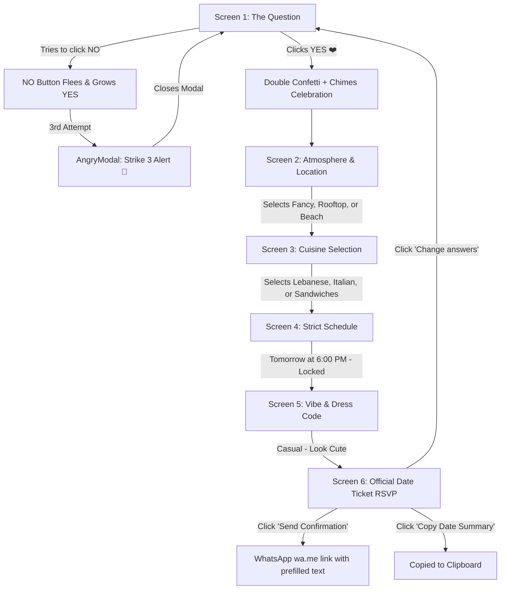

# Dana's Date Invitation ❤️ — Complete Documentation

An interactive, playful, and romantic single-page web application designed as an unforgettable date proposal for **Dana**. Built with modern React, Vite, Canvas particles, Web Audio API sound synthesis, and WhatsApp RSVP integration.

---

## 📖 Table of Contents
1. [Project Overview](#-project-overview)
2. [User Experience & Screen Flow](#-user-experience--screen-flow)
3. [Key Features & Mechanics](#-key-features--mechanics)
4. [Architecture & Component Hierarchy](#-architecture--component-hierarchy)
5. [Sound System (Web Audio API Synthesizer)](#-sound-system-web-audio-api-synthesizer)
6. [Visual Design & Aesthetic System](#-visual-design--aesthetic-system)
7. [Directory Structure](#-directory-structure)
8. [Configuration & Customization](#-configuration--customization)
9. [Getting Started & Development](#-getting-started--development)
10. [Production Build & Deployment](#-production-build--deployment)

---

## 🌟 Project Overview

**Dana's Date Invitation** is crafted to turn a simple date question into a memorable, humorous, and charming experience. Rather than a static message, it presents a step-by-step interactive journey where saying "NO" is nearly impossible, accepting is celebrated with confetti and chimes, and the date details (location, food, time, dress code) are collaboratively locked in before generating an official RSVP ticket sent straight to WhatsApp.

### Core Highlights
- **Playful Antics**: An elusive runaway "NO" button that dodges the cursor/finger, changes phrases, and enlarges the "YES" button.
- **"Strike 3" Anger Modal**: If the user manages or tries to hit "NO" three times, a dramatic scolding modal pops up.
- **Zero-Dependency Audio**: All sound effects (pops, dodges, dramatic scolding, celebration chimes) are generated natively using browser Web Audio API oscillators—no external MP3/WAV files required.
- **Fluid Floating Canvas**: An ambient particle canvas that renders drifting romantic hearts with bezier curves and twinkling stars.
- **WhatsApp RSVP Handshake**: Pre-formats an RSVP confirmation message with all selected date preferences, ready to send with one tap.

---

## 🗺️ User Experience & Screen Flow



### The 6 Experience Stages

1. **Stage 1: The Invitation (`ScreenInvitation.jsx`)**
   - Headline: *"Will you go on a date with me? ❤️"*
   - Hero pleading cat visual.
   - Runaway "NO" button with 12 cycling phrases (*"Nice try 😏"*, *"Too slow!"*, *"Error 404: No not found 💅"*).
   - "YES" button expands by 8% with each dodge (up to 145% scale).
   - Confetti storm + 5-note harmonic chime upon acceptance.

2. **Stage 1.5: Strike 3 Intervention (`AngryModal.jsx`)**
   - Triggers strictly on the 3rd attempt to hit "NO".
   - Dramatic downward sawtooth audio sting (`playAngry()`).
   - Playful scolding: *"You have pressed NO THREE TIMES. I am starting to take this personally. 😭💔"*.

3. **Stage 2: Atmosphere & Location (`ScreenLocation.jsx`)**
   - Header: *"Okay… since you said YES 😌❤️ Where are we heading?"*
   - Choices:
     - **Fancy** (Tag: *Boujee*): Fine dining & candlelight ✨.
     - **Rooftop** (Tag: *Atmospheric*): Panoramic skyline view 🌃.
     - **Beach** (Tag: *Scenic*): Marina & seaside breeze 🌊.

4. **Stage 3: Culinary Feast (`ScreenFood.jsx`)**
   - Header: *"And what are we eating?"*
   - Choices:
     - **Lebanese 🇱🇧** (Tag: *Elite Choice*): *“Because we have taste.”*
     - **Italian 🇮🇹** (Tag: *Romantic Classic*): *“A little pasta never hurt anyone. 🍝”*
     - **Sandwiches 🥪** (Tag: *Cozy & Chill*): *“Keeping it simple 😌”*

5. **Stage 4: Strict Schedule (`ScreenWhen.jsx`)**
   - Header: *"When? ⏰ (Spoiler: There is no date picker, don't even look for one)"*
   - Firmly locked in: **TOMORROW at 6:00 PM**.
   - Disabled mockup button: *“📅 Select alternative date — Option Disabled by Dana 💅”*.

6. **Stage 5: Vibe & Dress Code (`ScreenDressCode.jsx`)**
   - Header: *"What should you wear? 👕"*
   - Verdict: **CASUAL 😌✨** — *“Nothing too serious. Just look cute.”*
   - Mandatory Checklist:
     - Clean kicks & cozy vibes.
     - Fragrance on point.
     - Your best smile (mandatory).

7. **Stage 6: The Official Ticket & RSVP (`ScreenFinal.jsx`)**
   - Header: *"IT'S A DATE. ❤️ Congratulations. You have successfully agreed to go on a date with me."*
   - Digital Ticket Pass (**#DANA-001**) displaying all finalized parameters.
   - Dual actions:
     - **WhatsApp Dispatch**: Direct launch to `wa.me/+96171273152`.
     - **Copy Summary**: Clipboard copy with fallback support.
     - Playful Restart: *"Change your answers? (Nice try)"*.

---

## ⚙️ Key Features & Mechanics

### Runaway Button Collision Physics
Located in [`ScreenInvitation.jsx`](file:///c:/Projects/dana/src/components/ScreenInvitation.jsx):
- Computes viewport dimensions (`window.innerWidth`, `window.innerHeight`).
- Obtains bounding rectangle of the YES button.
- Runs an iterative rejection sampling algorithm (up to 15 attempts) with a **40px protective buffer** around the YES button so the NO button never obscures the YES button.
- Clamps position within safe screen padding (`pad = 20px`).
- Supports both desktop pointer hover (`onMouseEnter`) and mobile touch events (`onTouchStart`, `onClick`).

### Multi-Stage Confetti Explosions
Using `canvas-confetti`:
- Wave 1: Immediate centered burst (80 particles, spread 70).
- Wave 2: Dual angled side canons (left 60° and right 120° angles, 60 particles each).
- Custom romantic color palette: `#ff4d6d`, `#ff758f`, `#ffb3c1`, `#ffd166`, `#ffffff`.

---

## 🔊 Sound System (Web Audio API Synthesizer)

Implemented in [`src/utils/sound.js`](file:///c:/Projects/dana/src/utils/sound.js), the app does not rely on static sound files that could fail to load or be blocked by cross-origin policies. It uses real-time Web Audio API frequency synthesis:

| Method | Waveform | Frequency Ramp | Duration | Used In |
|---|---|---|---|---|
| `playPop()` | Sine | 440 Hz → 880 Hz | 80 ms | Option clicks, next buttons, card selections |
| `playDodge()` | Triangle | 300 Hz → 900 Hz | 120 ms | NO button running away |
| `playAngry()` | Sawtooth | 260 Hz → 180 Hz | 250 ms | Strike 3 Angry Modal alert |
| `playCelebration()` | Sine (Arpeggio) | C5 (523Hz), E5 (659Hz), G5 (784Hz), C6 (1046Hz), E6 (1318Hz) | 400 ms per note | YES acceptance & Final screen |

*Note: A global mute toggle button (`Volume2` / `VolumeX`) is located in the top navigation bar.*

---

## 🎨 Visual Design & Aesthetic System

The visual design is built with custom CSS variables adhering to modern glassmorphism principles:

### Color Palette
- **Deep Velvet Canvas**: `#0d0208` to `#1a040d` (rich dark romantic vignette).
- **Primary Accent**: `#ff4d6d` (vivid romantic rose).
- **Soft Accent**: `#ff758f` & `#ffb3c1` (playful pastel pinks).
- **Gold Champagne**: `#ffd166` (celebratory highlights).
- **Glassmorphism Panels**: `rgba(255, 255, 255, 0.05)` backdrop with `blur(20px)` and subtle border `rgba(255, 255, 255, 0.12)`.

### Typography
Imported via Google Fonts in [`index.html`](file:///c:/Projects/dana/index.html):
- **Playfair Display**: Elegant serif typography for primary titles.
- **Dancing Script**: Cursive handwritten flair for accents and signatures.
- **Outfit**: Clean, high-legibility geometric sans-serif for UI labels and descriptions.

---

## 📁 Directory Structure

```
dana/
├── public/
│   ├── favicon.svg             # Heart favicon
│   ├── icons.svg               # SVG asset bundle
│   └── gifs/                   # Local cached GIF assets
│       ├── invitation_pleading.gif
│       ├── angry_strike_3.gif
│       ├── loc_skymate.gif
│       ├── loc_hawana.gif
│       ├── loc_jia.gif
│       ├── food_lebanese.gif
│       ├── food_italian.gif
│       ├── food_sandwiches.gif
│       ├── when_tomorrow.gif
│       ├── dress_casual.gif
│       └── final_date.gif
├── scripts/
│   └── fetch_gifs.cjs          # Automation script to cache Tenor GIFs locally
├── src/
│   ├── assets/                 # React asset logos
│   ├── components/
│   │   ├── AngryModal.jsx          # Strike 3 teasing modal
│   │   ├── BackgroundParticles.jsx # Canvas heart & star animation
│   │   ├── ProgressBar.jsx         # Stepper bar with back navigation
│   │   ├── ScreenInvitation.jsx    # Screen 1: Runaway NO & YES
│   │   ├── ScreenLocation.jsx      # Screen 2: Where are we heading?
│   │   ├── ScreenFood.jsx          # Screen 3: Food cravings
│   │   ├── ScreenWhen.jsx          # Screen 4: Strict schedule (Tomorrow 6 PM)
│   │   ├── ScreenDressCode.jsx     # Screen 5: Dress code guidelines
│   │   └── ScreenFinal.jsx         # Screen 6: RSVP Ticket & WhatsApp share
│   ├── utils/
│   │   ├── sound.js            # Web Audio API procedural sound engine
│   │   └── whatsapp.js         # WhatsApp deep-link and text builder
│   ├── App.css                 # Glassmorphic responsive styling & keyframe animations
│   ├── App.jsx                 # Master application controller & screen state
│   ├── index.css               # Global resets, CSS variables, base styles
│   └── main.jsx                # React root bootstrap
├── index.html                  # HTML5 entry with meta tags & Google Fonts
├── package.json                # Project dependencies and npm scripts
├── vite.config.js              # Vite configuration
└── README.md                   # Complete documentation (this file)
```

---

## 🔧 Configuration & Customization

### Modifying the WhatsApp Recipient
To change the recipient's phone number or template text, update [`src/utils/whatsapp.js`](file:///c:/Projects/dana/src/utils/whatsapp.js):
```javascript
const WHATSAPP_PHONE = '96171273152'; // Format: Country code + Number without '+' or dashes
```

### Modifying Date & Time
The date and time are locked in [`src/App.jsx`](file:///c:/Projects/dana/src/App.jsx) and [`src/components/ScreenWhen.jsx`](file:///c:/Projects/dana/src/components/ScreenWhen.jsx):
```javascript
const [selections, setSelections] = useState({
  location: '',
  food: '',
  time: '6:00 PM',
  date: 'Tomorrow',
  dressCode: 'Casual'
});
```

### Adding or Changing Locations / Cuisines
- **Locations**: Edit the `LOCATIONS` array in [`src/components/ScreenLocation.jsx`](file:///c:/Projects/dana/src/components/ScreenLocation.jsx).
- **Foods**: Edit the `FOODS` array in [`src/components/ScreenFood.jsx`](file:///c:/Projects/dana/src/components/ScreenFood.jsx).

---

## 🚀 Getting Started & Development

### Prerequisites
- [Node.js](https://nodejs.org/) (version 18+ recommended)
- [npm](https://www.npmjs.com/)

### Installation
Clone the repository and install all dependencies:
```bash
npm install
```

### Running Locally
Start the Vite development server with Hot Module Replacement (HMR):
```bash
npm run dev
```
The application will be accessible at: `http://localhost:5173/` (or the port specified by Vite).

### Linting
Run the fast Oxlint linter:
```bash
npm run lint
```

---

## 📦 Production Build & Deployment

### Build the Bundle
To compile optimized static assets for production:
```bash
npm run build
```
The production bundle will be output to the `dist/` directory.

### Preview the Production Build
Test the compiled distribution locally before deploying:
```bash
npm run preview
```

### Hosting Options
Because this project compiles into pure static HTML/JS/CSS, it can be deployed instantly to:
- **Vercel** (`vercel deploy`)
- **Netlify** (`netlify deploy`)
- **GitHub Pages** (via GitHub Actions or `gh-pages`)
- **Cloudflare Pages**
